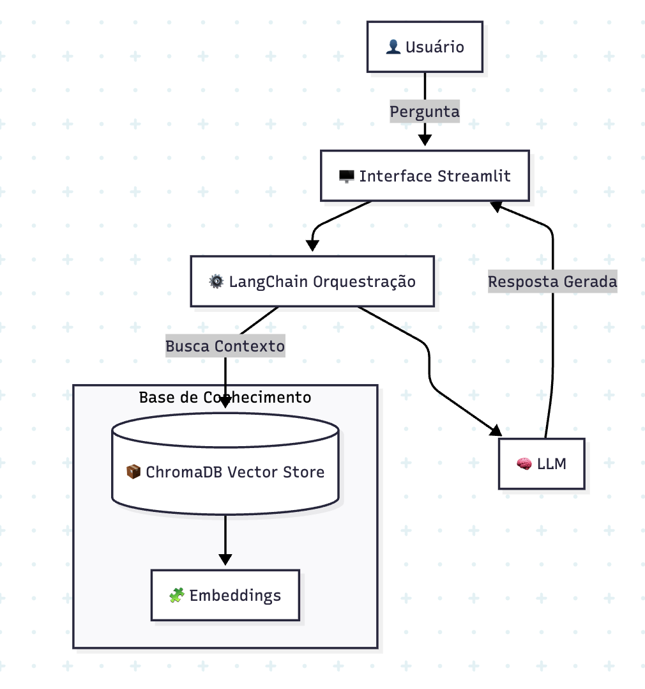

# RAG Corporativo Multi-Área

Aplicação em Python para busca semântica e resposta a dúvidas corporativas com base em documentos internos (PDF, DOCX e TXT). O sistema utiliza arquitetura RAG (Retrieval-Augmented Generation) com indexação vetorial por departamentos e interface web em Streamlit.

---

## 📐 Arquitetura do Sistema

O fluxo de dados combina vetorização local com geração de respostas via LLM, garantindo que as respostas sejam extraídas exclusivamente dos documentos fornecidos.



### Fluxo de Funcionamento:
1. **Ingestão e Processamento:** Os documentos são carregados no painel administrativo, divididos em blocos (chunks) e convertidos em vetores semânticos.
2. **Armazenamento Vetorial:** Os vetores são indexados no ChromaDB e categorizados por área corporativa (ex.: RH, TI/Suporte, Financeiro).
3. **Recuperação (Retrieval):** Quando o usuário envia uma pergunta, o sistema consulta a base vetorial da área selecionada e recupera os trechos com maior similaridade semântica.
4. **Geração da Resposta (Generation):** Os trechos recuperados alimentam o modelo Google Gemini 2.5 Flash junto a instruções estritas para responder apenas com base no contexto fornecido, acompanhado de citações da fonte.

---

## 🛠️ Tecnologias Utilizadas

- **Interface:** [Streamlit](https://streamlit.io/) + `extra-streamlit-components` (gerenciamento de sessão e navegação).
- **Orquestração RAG:** [LangChain](https://www.langchain.com/) (cadeia RAG, manipulação de contexto e histórico conversacional).
- **Modelo de Linguagem (LLM):** Google Gemini 2.5 Flash (`langchain-google-genai`).
- **Embeddings:** HuggingFace `sentence-transformers` (`all-MiniLM-L6-v2`).
- **Banco Vetorial:** ChromaDB (persistência local dos embeddings).
- **Processamento de Documentos:** `pypdf` (PDFs) e `python-docx` (documentos Word).
- **Autenticação:** `bcrypt` para hash e validação de credenciais administrativas.

---

## 🚀 Como Executar o Projeto

### Pré-requisitos
- Python 3.10 ou superior instalados no sistema.
- Chave de API da Google Generative AI ([Google AI Studio](https://aistudio.google.com/)).

### 1. Clonar o repositório
```bash
git clone https://github.com/seu-usuario/rag-corporativo-multi-area.git
cd rag-corporativo-multi-area
```

### 2. Criar e ativar o ambiente virtual
```bash
# Linux / macOS
python3 -m venv .venv
source .venv/bin/activate

# Windows (PowerShell)
python -m venv .venv
.\.venv\Scripts\Activate.ps1
```

### 3. Instalar as dependências
```bash
pip install -r requirements.txt
```

### 4. Iniciar a aplicação
```bash
streamlit run app_rag_chroma_v2.py
```

A aplicação estará acessível no navegador pelo endereço `http://localhost:8501`.

---

## ⚙️ Configuração Inicial e Primeiro Acesso

1. **Primeiro Acesso (Master Admin):** Ao executar o projeto pela primeira vez sem usuários cadastrados, a interface apresentará um assistente de configuração para criar a conta de usuário Administrador Master.
2. **Configuração da API Key:**
   - Faça login como Administrador pelo botão no menu lateral.
   - Insira sua **Google API Key** no campo correspondente nas configurações da barra lateral e clique em **Salvar**.
3. **Upload de Documentos:**
   - Acesse o painel Admin -> **Uploads**.
   - Escolha a área de destino (RH, Suporte, Financeiro ou novas áreas cadastradas) e envie os arquivos desejados para indexação.

---

## 🔄 Inicialização Automática e Autonomia de Arquivos

A aplicação foi desenvolvida com arquitetura de **autocriação de ambiente (Zero Configuration)**. Ao executar o projeto em um novo ambiente ou servidor:

- **Criação Automática de Configurações JSON:** Na primeira inicialização, o código detecta a ausência dos arquivos `settings.json`, `areas.json`, `usuarios.json` e `knowledge_index.json` e os gera automaticamente com parâmetros padrão seguros.
- **Detecção de Primeiro Uso (Wizard Master Admin):** Se a base de usuários estiver vazia, a interface exibe automaticamente a tela de cadastro inicial para criação do usuário Administrador Master.
- **Criação Dinâmica de Diretórios Locais:**
  - `chroma_db/`: Criado e gerenciado automaticamente na primeira inserção de vetores.
  - `knowledge_files/`: Criado dinamicamente para armazenar os documentos carregados.
  - `.streamlit/secrets.toml`: Gerado automaticamente ao salvar a Google API Key pela interface web.

Esta abordagem permite que o repositório no GitHub contenha apenas o código limpo, sem necessidade de enviar bancos de dados, arquivos temporários ou dados sensíveis.

---

## 📂 Estrutura do Repositório

```text
├── app_rag_chroma_v2.py    # Código principal da aplicação Streamlit e lógica RAG
├── Arquitetura.png         # Diagrama de arquitetura do sistema
├── requirements.txt        # Lista de dependências do projeto
├── .gitignore              # Regras de exclusão do Git (segredos, bancos e logs)
└── README.md               # Documentação técnica do repositório
```

---

## 🛡️ Segurança e Privacidade

- **Arquivos locais e banco vetorial:** A base vetorial (`chroma_db/`), os documentos enviados (`knowledge_files/`) e as configurações de usuários/logs são gerados localmente na primeira execução e estão incluídos no `.gitignore`.
- **Credenciais:** Chaves de API e hashes de senha não devem ser commitados no controle de versão.
